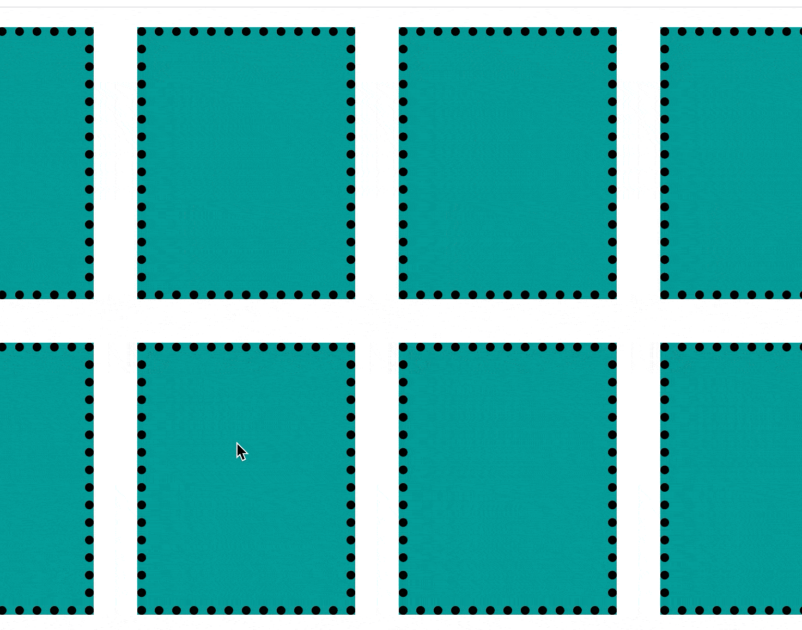

[](https://badge.fury.io/js/%40kurpachsv%2Fdnd-scrolling)

# @kurpachsv/dnd-scrolling

Simple component which allows to scroll window in dnd dragging.



## Usage

```javascript
import withScrolling from '@kurpachsv/dnd-scrolling';

const ScrollingContainer = withScrolling('div');
```

And wrap your component in ScrollingContainer.
For more details see examples.

## License

[](http://opensource.org/licenses/MIT)

Copyright (c) Sergei Kurpach, 2019
